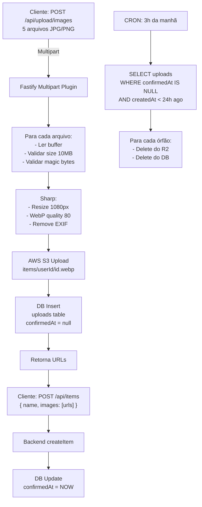

# TáComQuem Upload de Fotos com R2 — Plano de Implementação

> **For Claude:** REQUIRED SUB-SKILL: Use superpowers:executing-plans to implement this plan task-by-task.

**Goal:** Implementar upload de fotos de itens com compactação server-side em WebP e armazenamento no Cloudflare R2.

**Architecture:** Rota autenticada `POST /api/upload/images` que recebe múltiplos arquivos, compacta com Sharp (1080px max, WebP, quality 80%), faz upload para R2, registra metadata com cleanup automático de órfãos após 24h.

**Tech Stack:** Fastify, Sharp (image processing), AWS SDK S3 (R2 compatible), @fastify/multipart

**Referências:**
- [Sharp Documentation](https://sharp.pixelplumbing.com/)
- [AWS SDK S3 Client](https://docs.aws.amazon.com/sdk-for-javascript/latest/)
- [Fastify Multipart](https://github.com/fastify/fastify-multipart)
- [Cloudflare R2 Docs](https://developers.cloudflare.com/r2/)
- [Cron Jobs in Bun](https://bun.sh/docs/guides/cron)

---

## Fase 1: Configuração e Dependências

### Task 1.1: Instalar dependências

**Step 1: Adicionar Sharp e AWS SDK**

```bash
bun add sharp @aws-sdk/client-s3 file-type
bun add -d @types/sharp
```

**Step 2: Adicionar Fastify Multipart e Cron**

```bash
bun add @fastify/multipart node-cron
```

**Step 3: Commit**

```bash
git add package.json bun.lockb
git commit -m "chore: add image processing and R2 dependencies"
```

---

### Task 1.2: Atualizar variáveis de ambiente

**Files:**
- Modify: `.env.example`
- Modify: `src/config/env.ts`

**Step 1: Adicionar R2 vars em .env.example**

```env
# Cloudflare R2
R2_ACCOUNT_ID=your_account_id
R2_ACCESS_KEY_ID=your_access_key_id
R2_SECRET_ACCESS_KEY=your_secret_access_key
R2_BUCKET_NAME=tacq-images
R2_PUBLIC_URL=https://images.tacq.app
```

**Step 2: Atualizar src/config/env.ts**

```typescript
// Adicionar no envSchema:
R2_ACCOUNT_ID: z.string(),
R2_ACCESS_KEY_ID: z.string(),
R2_SECRET_ACCESS_KEY: z.string(),
R2_BUCKET_NAME: z.string(),
R2_PUBLIC_URL: z.string().url(),
```

**Step 3: Commit**

```bash
git add .env.example src/config/env.ts
git commit -m "chore: add R2 environment variables"
```

---

### Task 1.3: Criar tabela de uploads no schema

**Files:**
- Modify: `src/db/schema.ts`

**Step 1: Adicionar tabela uploads**

```typescript
export const uploads = pgTable('uploads', {
  id: uuid('id').primaryKey().defaultRandom(),
  userId: uuid('user_id')
    .notNull()
    .references(() => users.id, { onDelete: 'cascade' }),
  url: text('url').notNull().unique(),           // URL pública completa
  key: text('key').notNull(),                    // items/userId/xyz.webp
  filename: varchar('filename', { length: 255 }).notNull(),
  mimeType: varchar('mime_type', { length: 100 }).notNull(),
  sizeBytes: integer('size_bytes').notNull(),
  confirmedAt: timestamp('confirmed_at'),        // NULL = órfão
  createdAt: timestamp('created_at').defaultNow().notNull(),
});

export const uploadsRelations = relations(uploads, ({ one }) => ({
  user: one(users, {
    fields: [uploads.userId],
    references: [users.id],
  }),
}));
```

**Step 2: Adicionar relation ao users**

```typescript
// Em usersRelations:
uploads: many(uploads),
```

**Step 3: Gerar migration**

```bash
bun run db:generate
# Revisar: cat drizzle/migrations/latest.sql
bun run db:migrate
```

**Step 4: Commit**

```bash
git add src/db/schema.ts drizzle/
git commit -m "feat: add uploads table for tracking"
```

---

## Fase 2: Serviço de Storage

### Task 2.1: Criar configuração do R2

**Files:**
- Create: `src/config/r2.ts`

**Step 1: Criar src/config/r2.ts**

```typescript
import { S3Client } from '@aws-sdk/client-s3';
import { env } from './env.js';

export const r2Client = new S3Client({
  region: 'auto',
  endpoint: `https://${env.R2_ACCOUNT_ID}.r2.cloudflarestorage.com`,
  credentials: {
    accessKeyId: env.R2_ACCESS_KEY_ID,
    secretAccessKey: env.R2_SECRET_ACCESS_KEY,
  },
});
```

**Step 2: Commit**

```bash
git add src/config/r2.ts
git commit -m "feat: add R2 client configuration"
```

---

### Task 2.2: Criar serviço de processamento de imagem

**Files:**
- Create: `src/services/storage/index.ts`
- Create: `src/services/storage/__tests__/storage.test.ts`

**Step 1: Escrever testes primeiro**

```typescript
// src/services/storage/__tests__/storage.test.ts
import { describe, it, expect, beforeAll, afterAll, mock } from 'bun:test';
import { processAndUploadImage } from '../index.js';

describe('storage service', () => {
  describe('processAndUploadImage', () => {
    it('should validate image file type', async () => {
      const invalidFile = new File(['text content'], 'file.txt', { type: 'text/plain' });

      expect(async () => {
        await processAndUploadImage(invalidFile as any, 'user-id', 'file.txt');
      }).toThrow();
    });

    it('should reject file > 10MB', async () => {
      const largeFile = new File(
        [new ArrayBuffer(11 * 1024 * 1024)],
        'large.jpg',
        { type: 'image/jpeg' }
      );

      expect(async () => {
        await processAndUploadImage(largeFile as any, 'user-id', 'large.jpg');
      }).toThrow();
    });

    // Mais testes...
  });
});
```

**Step 2: Criar src/services/storage/index.ts**

```typescript
import sharp from 'sharp';
import { fileTypeFromBuffer } from 'file-type';
import { S3Client, PutObjectCommand, DeleteObjectCommand } from '@aws-sdk/client-s3';
import { nanoid } from 'nanoid';
import { db } from '../../db/index.js';
import { uploads } from '../../db/schema.js';
import { r2Client } from '../../config/r2.js';
import { env } from '../../config/env.js';

const MAX_FILE_SIZE = 10 * 1024 * 1024; // 10MB
const IMAGE_MAX_WIDTH = 1080;
const WEBP_QUALITY = 80;
const ALLOWED_MIMES = ['image/jpeg', 'image/png', 'image/webp', 'image/heic', 'image/tiff'];

export interface UploadResult {
  url: string;
  key: string;
  sizeBytes: number;
}

export interface ImageFile {
  filename: string;
  encoding: string;
  mimetype: string;
  file: AsyncIterable<Buffer>;
}

export async function processAndUploadImage(
  file: ImageFile,
  userId: string
): Promise<UploadResult> {
  // 1. Ler arquivo em buffer
  const buffers: Buffer[] = [];
  for await (const chunk of file.file) {
    buffers.push(chunk);
  }
  const fileBuffer = Buffer.concat(buffers);

  // 2. Validar tamanho
  if (fileBuffer.length > MAX_FILE_SIZE) {
    throw new Error(`Arquivo muito grande (máx ${MAX_FILE_SIZE / 1024 / 1024}MB)`);
  }

  // 3. Validar tipo de arquivo (magic bytes)
  const fileType = await fileTypeFromBuffer(fileBuffer);
  if (!fileType || !ALLOWED_MIMES.includes(fileType.mime)) {
    throw new Error('Tipo de arquivo não permitido. Use JPEG, PNG ou WebP.');
  }

  // 4. Processar com Sharp
  let processedBuffer: Buffer;
  try {
    processedBuffer = await sharp(fileBuffer)
      .resize(IMAGE_MAX_WIDTH, IMAGE_MAX_WIDTH, {
        fit: 'inside',
        withoutEnlargement: true,
      })
      .webp({ quality: WEBP_QUALITY })
      .toBuffer();
  } catch (error) {
    throw new Error(`Erro ao processar imagem: ${error instanceof Error ? error.message : 'unknown'}`);
  }

  // 5. Gerar chave única
  const id = nanoid(8);
  const timestamp = Date.now();
  const key = `items/${userId}/${id}-${timestamp}.webp`;
  const publicUrl = `${env.R2_PUBLIC_URL}/${key}`;

  // 6. Upload para R2
  try {
    await r2Client.send(
      new PutObjectCommand({
        Bucket: env.R2_BUCKET_NAME,
        Key: key,
        Body: processedBuffer,
        ContentType: 'image/webp',
        CacheControl: 'public, max-age=31536000', // 1 ano (immutable)
      })
    );
  } catch (error) {
    throw new Error(`Erro ao fazer upload: ${error instanceof Error ? error.message : 'unknown'}`);
  }

  // 7. Registrar no banco (confirmedAt = null para cleanup futuro)
  try {
    const [upload] = await db.insert(uploads).values({
      userId,
      url: publicUrl,
      key,
      filename: file.filename,
      mimeType: 'image/webp',
      sizeBytes: processedBuffer.length,
    }).returning();

    return {
      url: publicUrl,
      key: upload.key,
      sizeBytes: upload.sizeBytes,
    };
  } catch (error) {
    // Se falhar ao registrar, deletar do R2
    try {
      await r2Client.send(
        new DeleteObjectCommand({
          Bucket: env.R2_BUCKET_NAME,
          Key: key,
        })
      );
    } catch {
      // Ignorar erro ao cleanup
    }
    throw new Error(`Erro ao registrar upload: ${error instanceof Error ? error.message : 'unknown'}`);
  }
}

export async function deleteUploadFromR2(key: string): Promise<void> {
  await r2Client.send(
    new DeleteObjectCommand({
      Bucket: env.R2_BUCKET_NAME,
      Key: key,
    })
  );
}
```

**Step 3: Rodar testes**

```bash
bun test src/services/storage/__tests__/storage.test.ts
```

**Step 4: Commit**

```bash
git add src/services/storage/index.ts src/services/storage/__tests__/storage.test.ts
git commit -m "feat: add image processing and R2 upload service"
```

---

### Task 2.3: Criar serviço de cleanup de órfãos

**Files:**
- Create: `src/services/storage/cleanup.ts`

**Step 1: Criar src/services/storage/cleanup.ts**

```typescript
import cron from 'node-cron';
import { db } from '../../db/index.js';
import { uploads } from '../../db/schema.js';
import { isNull, lt } from 'drizzle-orm';
import { deleteUploadFromR2 } from './index.js';

const ORPHAN_TTL_HOURS = 24;

export function startCleanupJob() {
  // Roda diariamente às 3 da manhã
  cron.schedule('0 3 * * *', async () => {
    try {
      console.log('🧹 Starting orphan upload cleanup...');

      const orphanThreshold = new Date(Date.now() - ORPHAN_TTL_HOURS * 60 * 60 * 1000);

      const orphans = await db
        .select()
        .from(uploads)
        .where(
          and(
            isNull(uploads.confirmedAt),
            lt(uploads.createdAt, orphanThreshold)
          )
        );

      if (orphans.length === 0) {
        console.log('✅ No orphan uploads found');
        return;
      }

      console.log(`🗑️  Found ${orphans.length} orphan uploads to clean up`);

      for (const orphan of orphans) {
        try {
          // Deletar do R2
          await deleteUploadFromR2(orphan.key);

          // Deletar do DB
          await db.delete(uploads).where(eq(uploads.id, orphan.id));

          console.log(`✅ Cleaned up: ${orphan.key}`);
        } catch (error) {
          console.error(`❌ Failed to clean up ${orphan.key}:`, error);
        }
      }

      console.log('🧹 Cleanup job completed');
    } catch (error) {
      console.error('❌ Cleanup job failed:', error);
    }
  });
}
```

**Step 2: Commit**

```bash
git add src/services/storage/cleanup.ts
git commit -m "feat: add orphan upload cleanup CRON job"
```

---

## Fase 3: Rota de Upload

### Task 3.1: Criar rota de upload

**Files:**
- Create: `src/routes/upload/index.ts`

**Step 1: Criar src/routes/upload/index.ts**

```typescript
import type { FastifyInstance } from 'fastify';
import multipart from '@fastify/multipart';
import { processAndUploadImage, type UploadResult } from '../../services/storage/index.js';

export async function uploadRoutes(app: FastifyInstance) {
  // Registrar plugin multipart
  await app.register(multipart, {
    limits: {
      fileSize: 10 * 1024 * 1024, // 10MB
      files: 5, // máximo 5 arquivos
    },
  });

  app.post(
    '/images',
    {
      schema: {
        description: 'Upload de múltiplas fotos (compacta para WebP)',
        tags: ['Upload'],
        security: [{ BearerAuth: [] }],
        consumes: ['multipart/form-data'],
        response: {
          200: {
            type: 'object',
            properties: {
              images: {
                type: 'array',
                items: {
                  type: 'object',
                  properties: {
                    url: { type: 'string', format: 'uri' },
                    sizeBytes: { type: 'number' },
                  },
                },
              },
            },
          },
          400: {
            type: 'object',
            properties: {
              error: { type: 'string' },
            },
          },
        },
      },
      preHandler: [app.authenticate],
    },
    async (request, reply) => {
      const parts = request.parts();
      const uploadPromises: Promise<UploadResult>[] = [];
      let fileCount = 0;

      for await (const part of parts) {
        if (part.type === 'file') {
          fileCount++;
          if (fileCount > 5) {
            return reply.status(400).send({ error: 'Máximo 5 arquivos por upload' });
          }

          // Processa arquivo em paralelo
          uploadPromises.push(
            processAndUploadImage(part as any, request.user.userId).catch(error => {
              throw error;
            })
          );
        }
      }

      if (uploadPromises.length === 0) {
        return reply.status(400).send({ error: 'Nenhum arquivo foi enviado' });
      }

      try {
        const results = await Promise.all(uploadPromises);

        return reply.send({
          images: results.map(r => ({
            url: r.url,
            sizeBytes: r.sizeBytes,
          })),
        });
      } catch (error) {
        const message = error instanceof Error ? error.message : 'Erro ao processar upload';
        return reply.status(400).send({ error: message });
      }
    }
  );
}
```

**Step 2: Commit**

```bash
git add src/routes/upload/index.ts
git commit -m "feat: add upload route for images"
```

---

### Task 3.2: Registrar rota no app

**Files:**
- Modify: `src/app.ts`

**Step 1: Adicionar em src/app.ts**

```typescript
import { uploadRoutes } from './routes/upload/index.js';
import { startCleanupJob } from './services/storage/cleanup.js';

// Dentro de buildApp():
await app.register(uploadRoutes, { prefix: '/api/upload' });

// Retornar app:
return app;

// No index.ts, após app.listen():
startCleanupJob(); // Inicia CRON de cleanup
```

**Step 2: Commit**

```bash
git add src/app.ts
git commit -m "feat: register upload routes and start cleanup job"
```

---

## Fase 4: Integração com Items

### Task 4.1: Confirmar uploads ao criar item

**Files:**
- Modify: `src/services/items.ts`

**Step 1: Atualizar createItem para confirmar uploads**

```typescript
import { eq, inArray } from 'drizzle-orm';
import { uploads } from '../db/schema.js';

export async function createItem(
  ownerId: string,
  input: CreateItemInput
): Promise<ItemResponse> {
  const [item] = await db.insert(items).values({
    ownerId,
    name: input.name,
    description: input.description,
    images: JSON.stringify(input.images || []),
  }).returning();

  // Confirmar uploads específicas (marcar como não-órfão)
  if (input.images && input.images.length > 0) {
    await db
      .update(uploads)
      .set({ confirmedAt: new Date() })
      .where(
        and(
          eq(uploads.userId, ownerId),
          inArray(uploads.url, input.images)
        )
      );
  }

  return toItemResponse(item);
}
```

**Step 2: Commit**

```bash
git add src/services/items.ts
git commit -m "feat: confirm uploads when creating item"
```

---

## Fase 5: Documentação e Testes

### Task 5.1: Criar documentação de uso

**Files:**
- Create: `docs/UPLOAD_API.md`

**Step 1: Criar docs/UPLOAD_API.md**

```markdown
# Upload de Fotos - API

## Endpoint

```
POST /api/upload/images
Authorization: Bearer <token>
Content-Type: multipart/form-data
```

## Request

```bash
curl -X POST http://localhost:3000/api/upload/images \
  -H "Authorization: Bearer YOUR_TOKEN" \
  -F "images=@photo1.jpg" \
  -F "images=@photo2.png" \
  -F "images=@photo3.webp"
```

## Response (200 OK)

```json
{
  "images": [
    {
      "url": "https://images.tacq.app/items/user-id/abc12345-1707000000000.webp",
      "sizeBytes": 125430
    },
    {
      "url": "https://images.tacq.app/items/user-id/def67890-1707000000001.webp",
      "sizeBytes": 98765
    }
  ]
}
```

## Errors

**400 Bad Request - Invalid file type**
```json
{
  "error": "Tipo de arquivo não permitido. Use JPEG, PNG ou WebP."
}
```

**400 Bad Request - File too large**
```json
{
  "error": "Arquivo muito grande (máx 10MB)"
}
```

**400 Bad Request - No files sent**
```json
{
  "error": "Nenhum arquivo foi enviado"
}
```

**413 Payload Too Large**
```json
{
  "error": "Requisição muito grande"
}
```

**503 Service Unavailable**
```json
{
  "error": "Erro ao fazer upload: Storage unavailable"
}
```

## Características

- ✅ Aceita até 5 arquivos por request
- ✅ Máximo 10MB por arquivo
- ✅ Compacta automaticamente para WebP
- ✅ Redimensiona para 1080px (mantendo aspect ratio)
- ✅ Remove EXIF metadata
- ✅ Processa uploads em paralelo
- ✅ Cleanup automático de órfãos após 24h

## Tipos de arquivo aceitos

- JPEG (.jpg, .jpeg)
- PNG (.png)
- WebP (.webp)
- HEIC (.heic)
- TIFF (.tiff)

## Cleanup de órfãos

Uploads que não são confirmados em um item são deletados automaticamente após 24 horas.

**Como confirmar um upload:**
1. Fazer upload: `POST /api/upload/images`
2. Copiar URL da resposta
3. Criar item: `POST /api/items` com `images: [url]`

Se o item for criado, o upload é confirmado e não será deletado.
Se o upload não for usado, será deletado após 24h.
```

**Step 2: Commit**

```bash
git add docs/UPLOAD_API.md
git commit -m "docs: add upload API documentation"
```

---

### Task 5.2: Testar fluxo completo

**Step 1: Verificar que tudo está funcionando**

```bash
# 1. Build e verificar type checking
bun run qa

# 2. Rodar testes
bun test

# 3. Iniciar servidor
bun run dev
```

**Step 2: Testar manualmente**

```bash
# 1. Registrar usuário
curl -X POST http://localhost:3000/api/auth/register \
  -H "Content-Type: application/json" \
  -d '{
    "name": "Test User",
    "email": "test@example.com",
    "password": "password123"
  }'

# 2. Login
TOKEN=$(curl -X POST http://localhost:3000/api/auth/login \
  -H "Content-Type: application/json" \
  -d '{
    "email": "test@example.com",
    "password": "password123"
  }' | jq -r '.accessToken')

# 3. Upload de imagem
curl -X POST http://localhost:3000/api/upload/images \
  -H "Authorization: Bearer $TOKEN" \
  -F "images=@/path/to/image.jpg"

# 4. Criar item com a imagem
curl -X POST http://localhost:3000/api/items \
  -H "Authorization: Bearer $TOKEN" \
  -H "Content-Type: application/json" \
  -d '{
    "name": "Furadeira",
    "description": "Furadeira Bosch",
    "images": ["https://images.tacq.app/items/..."]
  }'
```

**Step 3: Commit final**

```bash
git add -A
git commit -m "feat: complete image upload implementation with R2 and cleanup"
```

---

## Checklist de Implementação

- [ ] Dependências instaladas (Sharp, AWS SDK, multipart, cron)
- [ ] Variáveis de ambiente configuradas
- [ ] Tabela `uploads` criada e migrada
- [ ] Configuração R2 criada
- [ ] Serviço de processamento implementado e testado
- [ ] Serviço de cleanup implementado
- [ ] Rota de upload registrada
- [ ] Integração com items confirmando uploads
- [ ] Documentação completa
- [ ] Testes passando
- [ ] Type checking OK
- [ ] Testado manualmente

---

## Schema da Tabela Uploads

```sql
CREATE TABLE uploads (
  id UUID PRIMARY KEY DEFAULT gen_random_uuid(),
  user_id UUID NOT NULL REFERENCES users(id) ON DELETE CASCADE,
  url TEXT NOT NULL UNIQUE,
  key TEXT NOT NULL,
  filename VARCHAR(255) NOT NULL,
  mime_type VARCHAR(100) NOT NULL,
  size_bytes INTEGER NOT NULL,
  confirmed_at TIMESTAMP,
  created_at TIMESTAMP NOT NULL DEFAULT NOW()
);

CREATE INDEX idx_uploads_user_id ON uploads(user_id);
CREATE INDEX idx_uploads_confirmed_at ON uploads(confirmed_at);
```

---

## Fluxo Completo



---

## Variáveis de Ambiente Necessárias

```env
# R2
R2_ACCOUNT_ID=your-account-id
R2_ACCESS_KEY_ID=your-access-key
R2_SECRET_ACCESS_KEY=your-secret-key
R2_BUCKET_NAME=tacq-images
R2_PUBLIC_URL=https://images.tacq.app
```

**Onde conseguir:**
1. Cloudflare Dashboard → R2
2. Create bucket → `tacq-images`
3. Settings → API tokens
4. Generate token → Copy Account ID, Access Key ID, Secret
5. Settings → Custom domains → Add domain (`images.tacq.app`)

---

## Performance e Custos

**Estimativa para 1000 uploads/mês:**

- Sharp processing: ~50ms por imagem = 50s total (parallelizado)
- R2 upload: ~200ms = negligível com paralelização
- R2 storage: ~100KB compactado × 1000 = 100MB = ~$0.5/mês
- Cleanup CRON: 1× ao dia = negligível

**Otimizações implementadas:**
- Processamento paralelo (até 5 arquivos simultâneos)
- Cache control: 1 ano (max-age)
- WebP reduz tamanho 80%
- Cleanup automático evita lixo

